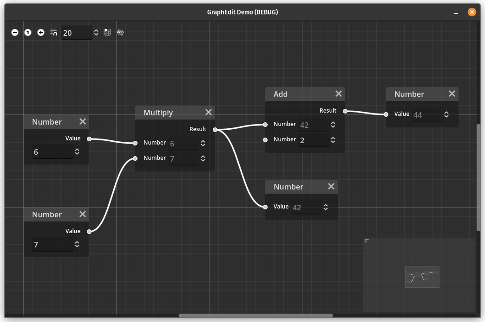

# GraphEdit Demo in Godot 4

This projects implements a simple GraphEdit where GraphNodes can be created via right-clicking and connected by dragging one node's output pin (on the right) towards another node's input pin (on the left).

GraphNodes hold numeric values, sum and multiply them, and display output results. Therefore, there are three node types: *Input*, *Math*, and *Output*.

The GraphEdit implements rules that only allow the creation of Directed Acyclic Graphs. The graph's topological sorting is computed using [Kahn's algorithm](https://en.wikipedia.org/wiki/Topological_sorting#Kahn's_algorithm) and adjacency lists.

